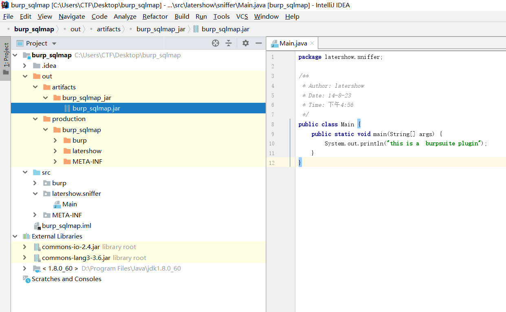
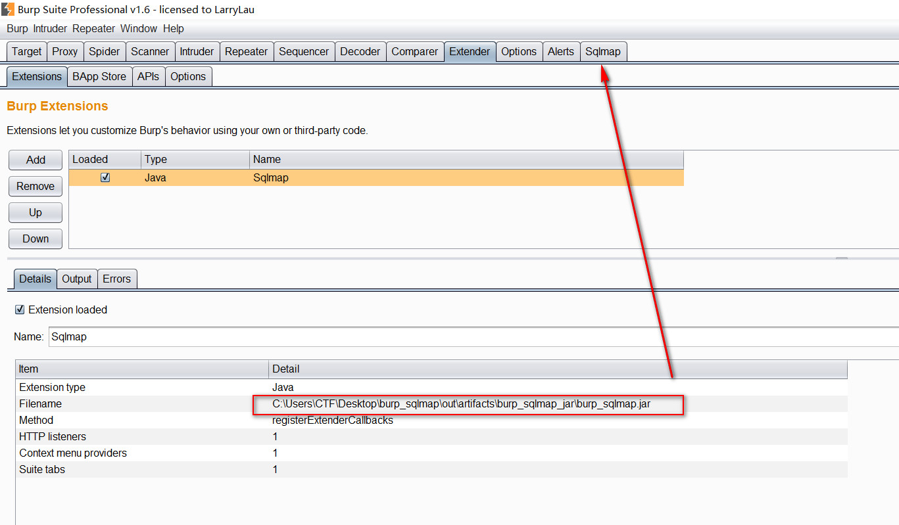
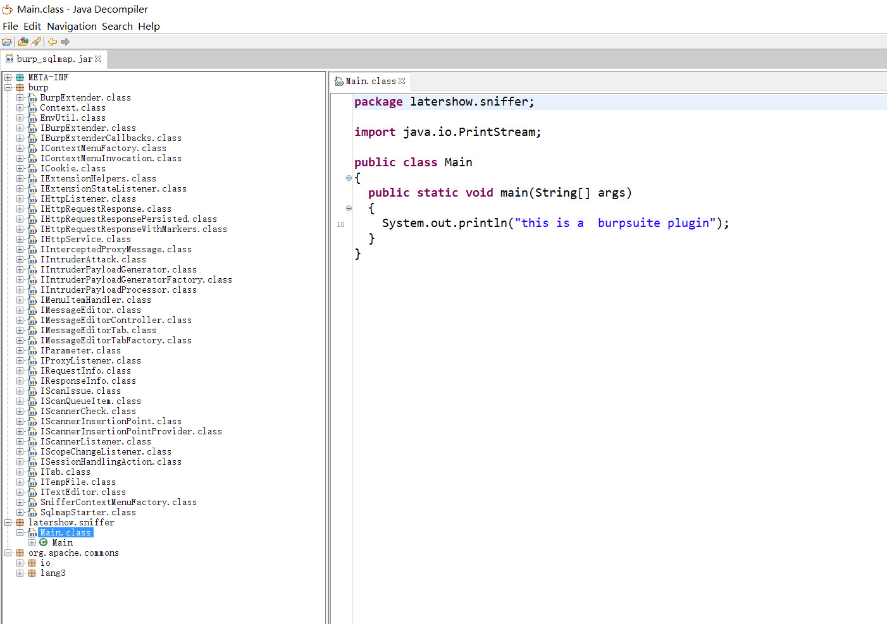
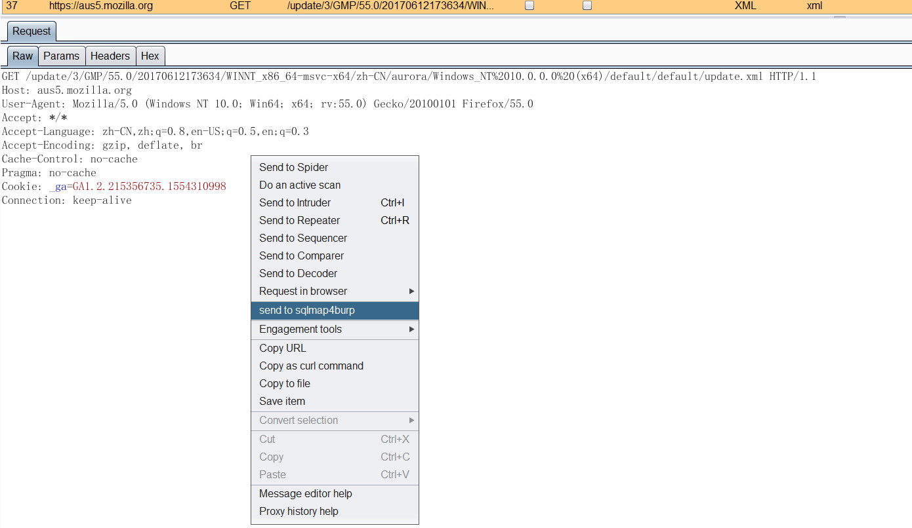
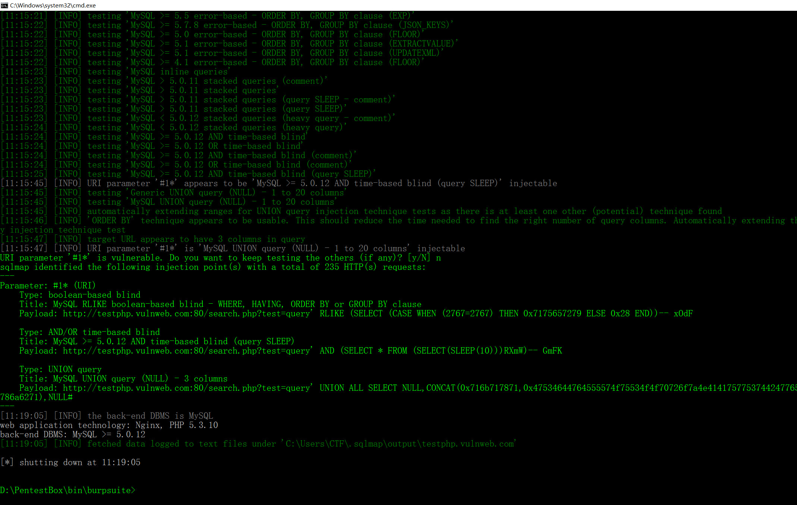

# SqlMap_BurpSuite

### 编译好的sqlmap.jar 

https://github.com/jas502n/SqlMap_BurpSuite/blob/master/burp_sqlmap/out/artifacts/burp_sqlmap_jar/burp_sqlmap.jar

### grep -r "send to Sqlmap"
`src/burp/SnifferContextMenuFactory.java:        JMenuItem jMenuItem = new JMenuItem("send to Sqlmap"); `

`JMenuItem jMenuItem = new JMenuItem("send to sqlmap4burp");`

https://github.com/jas502n/SqlMap_BurpSuite/blob/master/sqlmap4burp.jar

## 使用Burp, Sqlmap进行自动化批量SQL注入渗透测试

https://t0data.gitbooks.io/burpsuite/content/chapter18.html

### 参考链接

https://github.com/difcareer/sqlmap4burp

https://t0data.gitbooks.io/burpsuite/content/chapter18.html
